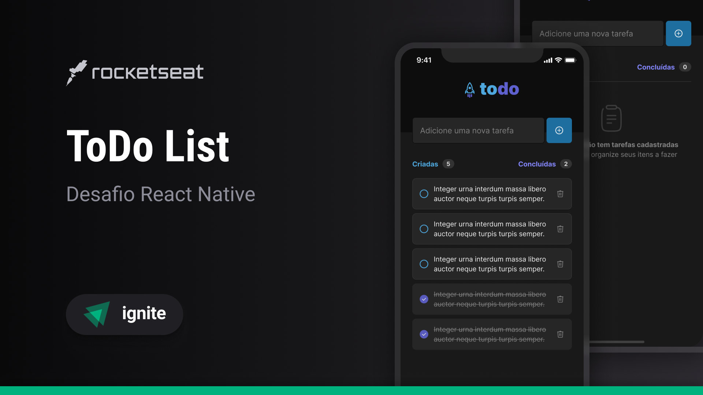

# To-Do List - React Native



Este é um aplicativo de controle de tarefas, no estilo **To-Do List**, desenvolvido com React Native. Ele permite que o usuário adicione, marque como concluída, remova e acompanhe o progresso de suas tarefas. O projeto foi desenvolvido como parte do desafio do **Ignite** da Rocketseat.

## Funcionalidades

- **Adicionar uma nova tarefa**: O usuário pode adicionar novas tarefas ao aplicativo.
- **Marcar e desmarcar uma tarefa como concluída**: Permite que o usuário marque as tarefas como concluídas e desmarque, se necessário.
- **Remover uma tarefa**: O usuário pode remover tarefas da lista de forma simples.
- **Exibir progresso de conclusão**: A aplicação mostra o progresso do número de tarefas concluídas em relação ao total de tarefas.

## Tecnologias Utilizadas

- **React Native**: Framework para desenvolvimento de aplicativos móveis nativos.
- **React**: Biblioteca JavaScript para construção da interface de usuário.
- **Expo**: Ferramenta que facilita o desenvolvimento de aplicativos React Native.
- **Typescript**: Linguagem que adiciona tipagem estática ao JavaScript, proporcionando uma experiência de desenvolvimento mais segura.

## Como rodar o projeto

### Requisitos

- Node.js
- Expo CLI
- Yarn (opcional, mas recomendado)

### Passos

1. Clone este repositório:
 ```bash
   git clone https://github.com/daluamon/toDoListReactNative.git
```
2. Navegue até o diretório do projeto:

 ```bash
   cd todo-list-react-native
```
3. Instale as dependências:

   Se você estiver utilizando o **Yarn**:
 ```bash
   yarn install
```
   Se estiver utilizando o **npm**:
 ```bash
   npm install
```

4. Inicie o projeto com Expo:
 ```bash
   expo start
```
   Isso abrirá a página do Expo no navegador e você poderá escanear o QR Code com o aplicativo Expo Go em seu dispositivo móvel.

## Como contribuir

1. Fork este repositório.
2. Crie uma branch com sua feature: `git checkout -b minha-feature`.
3. Faça suas alterações e commite: `git commit -m 'Adicionando nova funcionalidade'`.
4. Faça o push para a sua branch: `git push origin minha-feature`.
5. Abra um Pull Request para o repositório principal.

## Licença

Este projeto está sob a licença MIT. Veja o arquivo [LICENSE](LICENSE) para mais detalhes.

## Agradecimentos

- **Rocketseat**: Pelo excelente curso e desafio do Ignite.
- **React Native**: Para a criação de aplicativos móveis de maneira simples e eficiente.
